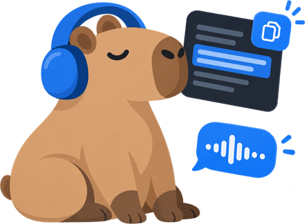
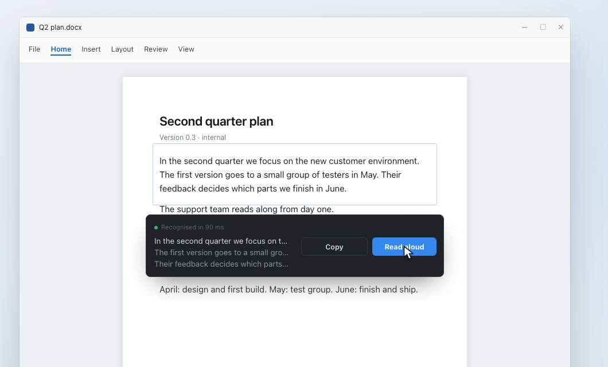
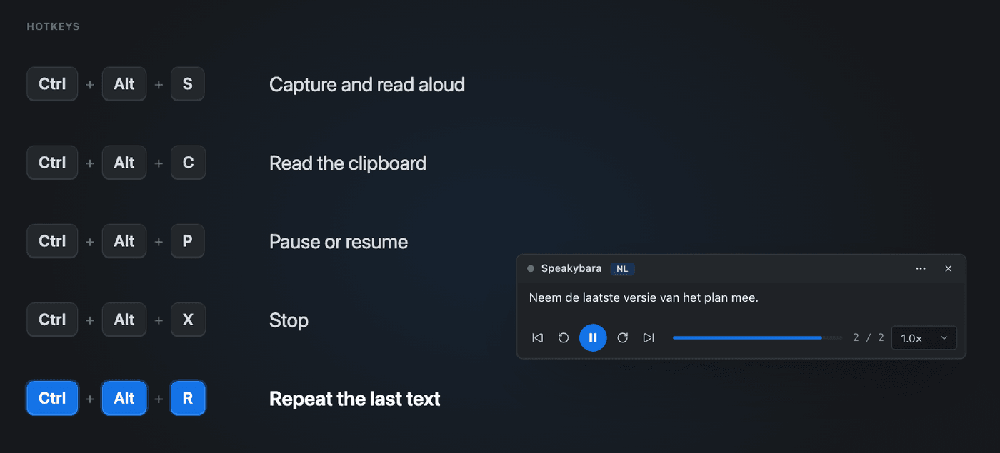
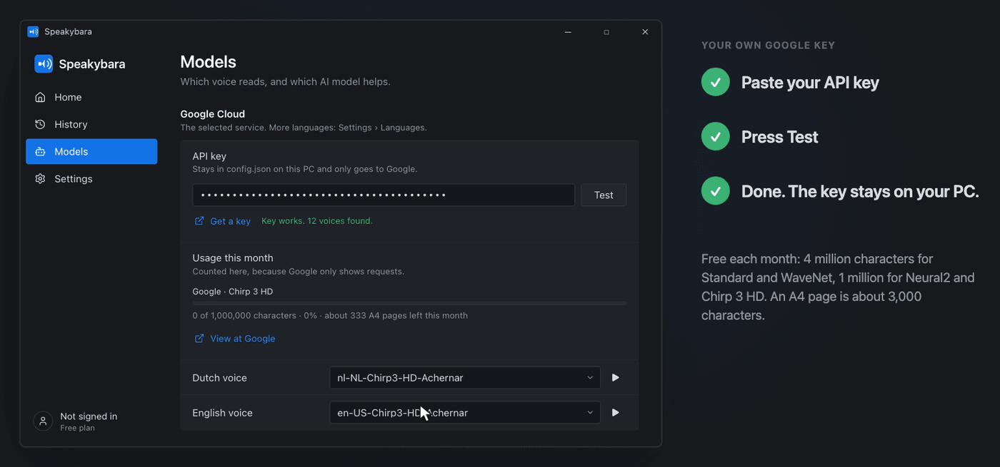

  

<h1 align="center">Speakybara</h1>

  <strong>Listen to your screenshots or copied text.</strong> 
  A free app for Windows and Mac that turns any part of your screen into text you can copy or listen to: 
  press a hotkey, drag a frame, done.

  
  

  
  
  

  <a href="https://speakybara.app">Website</a> ·
  <a href="https://speakybara.app/en/download">Download page</a> ·
  <a href="https://speakybara.app/en/feedback">Give feedback</a> ·
  <a href="#nederlands">Nederlands</a>

---

Most people already have a way to take a screenshot. Almost nobody has an easy way to get the **text** out of it, let alone hear it **read aloud**. Speakybara does exactly that, on anything you can see: a scanned PDF, an image in an email, a screenshot a colleague pasted in Teams, an error message you cannot select, a remote desktop, a paused video.

  
   Drag a frame over any text. It is recognised on your own computer; then you copy it or listen to it.

## Download

1. Go to the **[latest release](https://github.com/megakip/Speakybara/releases/latest)**.
2. Under **Assets**, pick the file for your computer:

| Computer | File | What it needs |
| --- | --- | --- |
| **Windows** | `Speakybara-<version>-windows.zip` | Windows 10 (build 19041) or newer, Windows 11 recommended, 64-bit |
| **Mac** | `Speakybara-<version>-macos.zip` | macOS 14 (Sonoma) or newer, on a Mac with Apple silicon (M1 or later). Intel Macs are not supported. |

Free. No account, no email address, no trial that ends. The [download page](https://speakybara.app/en/download) has the same files, plus the SHA-256 checksums so you can check that your file is the file we published.

## First start on Windows

Nothing gets installed. The app and everything it saves stay in the folder you unzip.

1. Right-click the zip → **Extract All**. Starting the app from inside the zip does not work.
2. Double-click **Speakybara.exe**.
3. Windows shows a blue screen: *"Windows protected your PC"*. Click **More info** → **Run anyway**.
4. Press `Ctrl` + `Alt` + `S` anywhere and drag a frame over some text. It is read aloud.

The blue warning appears because the app does not have a code-signing certificate yet, not because something is wrong with the file.

<strong>Updating on Windows</strong>

Unzip the new version into a new folder, then copy your own files over from the old folder: `config.json`, `history.json`, `annotations.json`, `words.json`, `pronunciations.json`, `usage.json`, `eigen-woorden.txt`, `english-words.txt` and the folders `previews` and `voices`.

## First start on Mac

1. Double-click the zip, then drag **Speakybara** into your **Applications** folder.
2. Open Speakybara. macOS says it cannot check the app for malware, because Apple has not signed it yet. Click **Done**.
3. Open **System Settings** → **Privacy & Security**, scroll down and click **Open Anyway** next to Speakybara. You only do this once.
   On macOS 14 you can also right-click the app → **Open** → **Open**.
4. Allow **Screen Recording** when Speakybara asks. Without it, the app cannot see the text in your frame.
5. Press `Control` + `Option` + `S` anywhere and drag a frame over some text. It is read aloud.

<strong>Updating on Mac</strong>

Replace the app in Applications and do steps 2 and 3 again. Your settings and history stay where they are.

Does Speakybara then say it has no Screen Recording permission, while the switch is on? macOS remembers the permission for the old version. Open **System Settings** → **Privacy & Security** → **Screen Recording**, select Speakybara, click **−** to remove it, then open Speakybara again and allow it.

## What it does

- **Select and listen.** Drag a frame around text on your screen. Speakybara recognises it and starts reading, even when the text cannot be selected.
- **Copy the text.** One hotkey puts the recognised text straight on your clipboard.
- **Hear your clipboard.** Copied something from an email, website or document? One hotkey reads it aloud. No pasting needed.
- **Adjust the frame.** The frame stays after you drag it: fine-tune it, then choose read aloud, copy or a quick action. Scroll inside the frame to grab more text than fits on your screen.
- **Follow along.** A highlight follows the speech on the page you captured, and a subtitle bar sits at the edge of your screen. Click a highlighted word to continue from that sentence.
- **Listen at your pace.** 0.8x to 1.75x, pause, go back 10 seconds, repeat the last text.
- **Read, mark and take notes.** Open any text on a reading page: highlight, add notes, look up what a word means, and export your notes as Markdown.
- **Quick actions.** Translate, explain, summarise, improve, or write your own instruction. Hear the answer or copy it. Uses your own key for OpenAI, Google Gemini or OpenRouter, or a model on your own computer.
- **Many voices.** Local voices that work offline (Piper and the voices of Windows or macOS), Microsoft Edge voices on Windows, and Google's Chirp 3 HD voices with your own key.
- **Many languages.** Reads 37 languages aloud; the app itself is available in 36. Which voices you get depends on the language and the voice service.

  
   Every hotkey works in every app, also when Speakybara has no window open.

### Hotkeys

| What it does | Windows | Mac |
| --- | --- | --- |
| Drag a frame, read it aloud | `Ctrl` `Alt` `S` | `⌃` `⌥` `S` |
| Drag a frame, copy the text | `Ctrl` `Alt` `E` | `⌃` `⌥` `E` |
| Drag a frame, let AI explain or summarise it | `Ctrl` `Alt` `U` | `⌃` `⌥` `U` |
| Drag a frame, then pick a quick action | `Ctrl` `Alt` `Q` | `⌃` `⌥` `Q` |
| Read the clipboard aloud | `Ctrl` `Alt` `C` | `⌃` `⌥` `C` |
| Pause or resume | `Ctrl` `Alt` `P` | `⌃` `⌥` `P` |
| Stop | `Ctrl` `Alt` `X` | `⌃` `⌥` `X` |
| Read the last text again | `Ctrl` `Alt` `R` | `⌃` `⌥` `R` |
| Show or hide the subtitle bar | not yet | `⌃` `⌥` `B` |

On a Mac, `⌃` is Control and `⌥` is Option. You can change every hotkey in the settings.

## Free and Managed

Speakybara is free, and that includes everything the app does: local voices offline, Microsoft Edge voices on Windows, and Google's best voices too if you bring your own Google Cloud key. Setting up that key takes about 15 minutes, once. Google gives you a free allowance every month.

  
   Your own Google key: paste it, press Test, done. The key stays on your computer.

**Speakybara Managed** comes after the test period. It is the same app, with Google's best voices running through a service we run, so you do not need a Google Cloud project, an API key or billing of your own. No extra features, no locked buttons. You will not pay for software, only for not having to set anything up. It is not for sale yet.

## Privacy

Text recognition runs on your own computer, with the OCR built into Windows or macOS. Pick an online voice or AI service and the **text** goes to that service; an image of your screen only goes along if you switch on *Explanations may look at your screen*, which is off by default. [Privacy policy](https://speakybara.app/en/privacy).

## Still in progress

This is a test version. Good to know:

- The apps are not signed yet. That is why Windows shows a warning and the Mac needs one extra step.
- The Mac version works on Apple silicon only (M1 or later).
- The Microsoft Edge voices are Windows-only.
- On Windows, text recognition needs the language of your text to be installed in Windows.
- Speakybara Managed comes after the test period.

## Feedback, bugs and ideas

Feedback is exactly why this test version is here. Tell us what works, what is confusing and what breaks.

- **[Give feedback on the website](https://speakybara.app/en/feedback)**, no account needed.
- Or **[open an issue](https://github.com/megakip/Speakybara/issues/new)**. Bugs and ideas are both welcome. Write what you did and what happened; a screenshot helps a lot. If the app does not start on Windows, attach `screenspeak-error.log` from the app folder.

## About this repository

This repository is where Speakybara's downloads, release notes and issues live. The source code of the app is not public. What changed in each version: [releases](https://github.com/megakip/Speakybara/releases) and the [changelog](https://speakybara.app/en/changelog).

---

## Nederlands

**Luister naar je screenshots of gekopieerde tekst.** Speakybara is een gratis app voor Windows en Mac die elk stuk van je scherm omzet in tekst die je kunt kopiëren of laten voorlezen: sneltoets, kader eromheen, klaar.

Het werkt op alles wat je ziet: een gescande pdf, een plaatje in een mail, een screenshot die een collega in Teams plakte, een foutmelding waar je niets uit kunt selecteren, een remote desktop, een gepauzeerde video.

**[Download de laatste versie](https://github.com/megakip/Speakybara/releases/latest)** · [Downloadpagina](https://speakybara.app/nl/download) · [Website](https://speakybara.app/nl) · [Feedback geven](https://speakybara.app/nl/feedback)

### Downloaden

1. Ga naar de **[laatste versie](https://github.com/megakip/Speakybara/releases/latest)**.
2. Kies onder **Assets** het bestand voor je computer:

| Computer | Bestand | Wat je nodig hebt |
| --- | --- | --- |
| **Windows** | `Speakybara-<versie>-windows.zip` | Windows 10 (build 19041) of nieuwer, Windows 11 aanbevolen, 64-bit |
| **Mac** | `Speakybara-<versie>-macos.zip` | macOS 14 (Sonoma) of nieuwer, op een Mac met Apple-chip (M1 of nieuwer). Een Mac met Intel-chip werkt niet. |

Gratis. Geen account, geen e-mailadres, geen proefperiode die afloopt. Op de [downloadpagina](https://speakybara.app/nl/download) staan dezelfde bestanden, met de SHA-256-controlesom om te checken dat jouw bestand ons bestand is.

### De eerste keer op Windows

Er wordt niets geïnstalleerd. De app en alles wat hij bewaart blijven in de map die je uitpakt.

1. Klik met de rechtermuisknop op de zip → **Alles uitpakken**. Vanuit de zip zelf starten werkt niet.
2. Dubbelklik op **Speakybara.exe**.
3. Windows toont een blauw scherm: *"Windows heeft uw pc beveiligd"*. Klik op **Meer informatie** → **Toch uitvoeren**.
4. Druk ergens op `Ctrl` + `Alt` + `S` en trek een kader om een stuk tekst. Het wordt voorgelezen.

Die waarschuwing komt doordat de app nog geen handtekeningcertificaat heeft, niet doordat er iets mis is met het bestand.

<strong>Updaten op Windows</strong>

Pak de nieuwe versie uit in een nieuwe map en neem je eigen bestanden mee uit de oude map: `config.json`, `history.json`, `annotations.json`, `words.json`, `pronunciations.json`, `usage.json`, `eigen-woorden.txt`, `english-words.txt` en de mappen `previews` en `voices`.

### De eerste keer op de Mac

1. Dubbelklik op de zip en sleep **Speakybara** naar de map **Apps** (Programma's).
2. Open Speakybara. macOS zegt dat het de app niet op malware kan controleren, omdat Apple hem nog niet heeft ondertekend. Klik op **Gereed**.
3. Open **Systeeminstellingen** → **Privacy en beveiliging**, scrol naar beneden en klik bij Speakybara op **Toch openen**. Dat hoef je maar één keer te doen.
   Op macOS 14 kan het ook zo: klik met de rechtermuisknop op de app → **Open** → **Open**.
4. Zet **Schermopname** aan als Speakybara erom vraagt. Zonder die toestemming ziet de app de tekst in je kader niet.
5. Druk ergens op `Control` + `Option` + `S` en trek een kader om een stuk tekst. Het wordt voorgelezen.

<strong>Updaten op de Mac</strong>

Vervang de app in de map Apps en doe stap 2 en 3 opnieuw. Je instellingen en geschiedenis blijven staan.

Zegt Speakybara daarna dat hij geen toestemming voor Schermopname heeft, terwijl de schakelaar aan staat? Dan onthoudt macOS de toestemming nog van de oude versie. Open **Systeeminstellingen** → **Privacy en beveiliging** → **Schermopname**, selecteer Speakybara, klik op **−** om hem weg te halen, open Speakybara opnieuw en geef toestemming.

### Wat Speakybara doet

- **Selecteer en luister.** Sleep een kader om tekst op je scherm. Speakybara herkent de tekst en leest direct voor, ook als je hem niet kunt selecteren.
- **Kopieer de tekst.** Met één sneltoets staat de herkende tekst op je klembord.
- **Laat je klembord praten.** Tekst gekopieerd uit een mail, website of document? Eén sneltoets leest hem voor. Plakken hoeft niet.
- **Stel het kader bij.** Het kader blijft staan na het slepen: stel het bij en kies eronder voorlezen, kopiëren of een snelle actie. Scrol in het kader om meer tekst te pakken dan op je scherm past.
- **Lees mee.** Een markering loopt mee op de pagina die je vastlegde, en een ondertitelbalk staat aan de rand van je scherm. Klik op een gemarkeerd woord om vanaf die zin verder te luisteren.
- **Luister in je eigen tempo.** 0,8x tot 1,75x, pauzeren, 10 seconden terug, de laatste tekst herhalen.
- **Lezen, markeren en notities.** Open een tekst op een leespagina: markeer, maak notities, zoek op wat een woord betekent en neem je notities mee als Markdown.
- **Snelle acties.** Vertalen, uitleggen, samenvatten, verbeteren of je eigen instructie. Luister naar het antwoord of kopieer het. Met je eigen sleutel voor OpenAI, Google Gemini of OpenRouter, of een model op je eigen computer.
- **Veel stemmen.** Lokale stemmen die offline werken (Piper en de stemmen van Windows of macOS), Microsoft Edge-stemmen op Windows, en de Chirp 3 HD-stemmen van Google met je eigen sleutel.
- **Veel talen.** Leest 37 talen voor; de app zelf is er in 36 talen. Welke stemmen je krijgt hangt af van de taal en de stemdienst.

De sneltoetsen staan in de tabel [hierboven](#hotkeys). Op een Mac is `⌃` de Control-toets en `⌥` de Option-toets. Je past ze allemaal aan in de instellingen.

### Gratis en Managed

Speakybara is gratis, en dat is alles wat de app kan: lokale stemmen offline, Microsoft Edge-stemmen op Windows, en ook de beste stemmen van Google als je je eigen Google Cloud-sleutel gebruikt. Die sleutel instellen kost eenmalig ongeveer 15 minuten. Google geeft je elke maand een gratis tegoed.

**Speakybara Managed** komt na de testperiode. Het is dezelfde app, met de beste stemmen van Google via een dienst die wij draaien, zodat je geen Google Cloud-project, geen API-sleutel en geen facturatie hoeft te regelen. Geen extra functies, geen vergrendelde knoppen. Je betaalt niet voor software, je betaalt ervoor dat je niets hoeft in te stellen. Het is nog niet te koop.

### Privacy

De tekstherkenning draait op je eigen computer, met die van Windows of macOS zelf. Kies je een onlinestem of AI-dienst, dan gaat de **tekst** naar die dienst; een beeld van je scherm gaat alleen mee als je *Uitleg mag meekijken op je scherm* aanzet, en dat staat standaard uit. [Privacyverklaring](https://speakybara.app/nl/privacy).

### Wat nog niet af is

Dit is een testversie. Goed om te weten:

- De apps zijn nog niet ondertekend. Daarom waarschuwt Windows en kost de Mac één extra stap.
- De Mac-versie werkt alleen op een Mac met Apple-chip (M1 of nieuwer).
- De Microsoft Edge-stemmen zijn er alleen op Windows.
- Op Windows moet de taal van je tekst in Windows zijn geïnstalleerd voor de tekstherkenning.
- Speakybara Managed komt na de testperiode.

### Feedback, fouten en ideeën

Daarvoor staat deze testversie hier. Vertel wat werkt, wat onduidelijk is en wat stukgaat.

- **[Geef feedback op de website](https://speakybara.app/nl/feedback)**, zonder account.
- Of **[open een issue](https://github.com/megakip/Speakybara/issues/new)**. Fouten en ideeën zijn allebei welkom. Schrijf op wat je deed en wat er gebeurde; een schermafbeelding helpt enorm. Start de app op Windows niet op, plak dan `screenspeak-error.log` uit de map erbij.

### Over deze repository

Hier staan de downloads, de wijzigingen per versie en de issues van Speakybara. De broncode van de app is niet openbaar. Wat er per versie veranderde: [releases](https://github.com/megakip/Speakybara/releases) en de [wijzigingen op de website](https://speakybara.app/nl/changelog).
